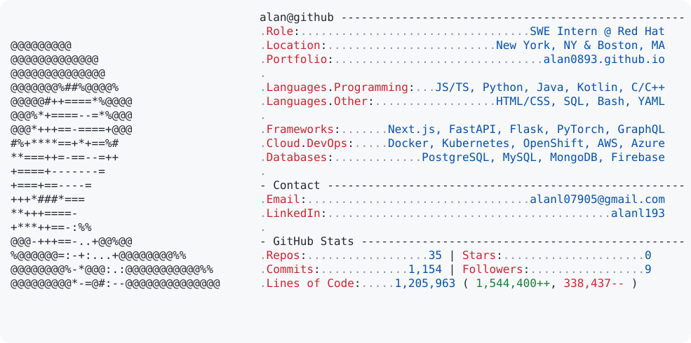

<h1 align="center">Hi, I'm Alan</h1>
<h3 align="center">SWE @ Red Hat</h3>

  <a href="https://alan0893.github.io/" target="_blank">Portfolio</a> |
  <a href="mailto:alanl07905@gmail.com" target="_blank">Email</a> |
  <a href="https://www.linkedin.com/in/alanl193/" target="_blank">LinkedIn</a>

  <picture>
    <source media="(prefers-color-scheme: dark)" srcset="dark_mode.svg">
    
  </picture>

  

